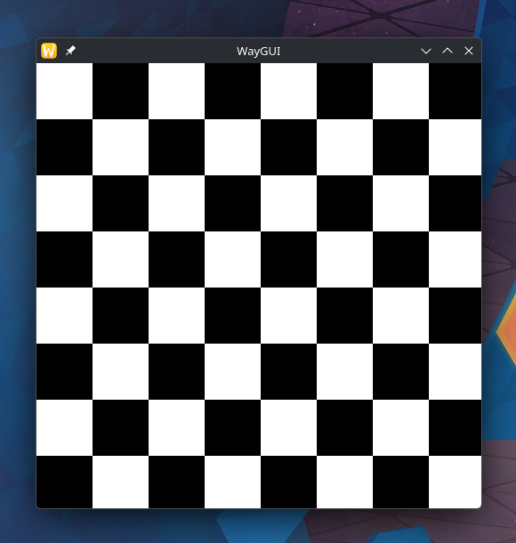

# WayGUI

A tiny library to create a window on wayland from scratch. The goal is to implement just enough functionality to open a
window and allow the user to draw their own pixels.

## Prototype

This window was created by `python/client.py`:

